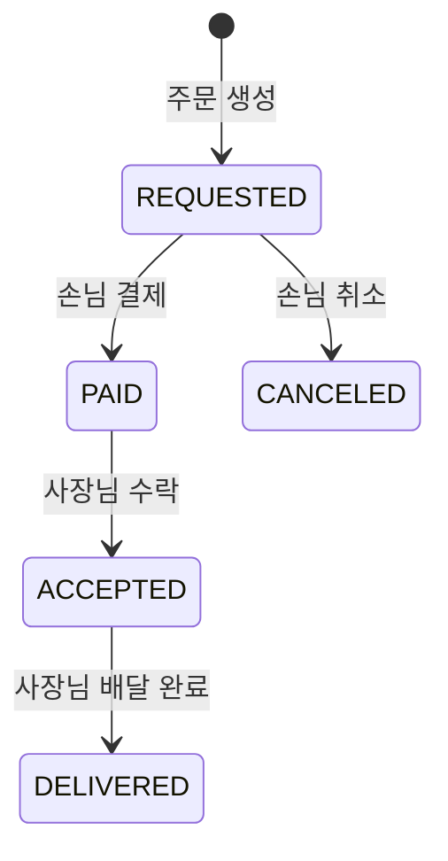

# 미니 배달 주문 서비스

사장님(OWNER)이 메뉴를 등록하면 손님(CUSTOMER)이 메뉴를 조회하고 주문·결제하고, 사장님이 결제된 주문을 수락하고 배달 완료로 처리하는 백엔드 API입니다. 화면 없이 Postman 같은 API 도구로 확인합니다.

- 사장님 한 명을 가게 한 곳으로 취급합니다. 가게(Store) 엔티티는 따로 없습니다.
- 주문 1건에는 메뉴 1개와 수량을 저장합니다.
- 실제 결제사(PG)와 연동하지 않고, 카드 결제 내역만 DB에 저장합니다.
- 배달 라이더 없이 사장님이 배달 완료를 처리합니다.

## 기술 환경

| 구분 | 내용 |
| --- | --- |
| 언어 | Java 21 |
| 프레임워크 | Spring Boot 4.1.1 (Spring Web MVC, Spring Data JPA, Spring Security, Validation) |
| 인증 | JWT (JJWT 0.13.0, HS256), BCrypt 비밀번호 해시 |
| DB | PostgreSQL 18 (Docker Compose) |
| 빌드 | Gradle (Groovy DSL, Wrapper 포함) |
| 기타 | Lombok, JPA Auditing |

## 실행 방법

### 1. 환경변수 준비

비밀번호와 JWT 비밀키는 코드나 설정 파일에 넣지 않고 환경변수로 받습니다.

| 이름 | 필수 | 설명 |
| --- | --- | --- |
| `DB_PASSWORD` | O | PostgreSQL `delivery` 계정의 비밀번호. Docker 컨테이너 생성과 애플리케이션 접속에 같은 값을 사용합니다. |
| `JWT_SECRET` | O | Base64로 인코딩한 32바이트(256비트) 이상의 HS256 서명 키. 더 짧으면 애플리케이션이 시작되지 않습니다. |

DB 이름과 계정은 `delivery`로 고정되어 있고, 접속 주소는 `jdbc:postgresql://localhost:5432/delivery`입니다. 액세스 토큰 만료 시간은 `application.yaml`의 `jwt.expiration-ms`(기본 1시간)입니다.

`.env.example`을 복사해 `.env`를 만들고 값을 채웁니다. `.env`는 `.gitignore`에 포함되어 있어 커밋되지 않습니다.

```bash
cp .env.example .env
```

`JWT_SECRET` 값은 다음처럼 만들 수 있습니다(Git Bash에 포함된 openssl 사용).

```bash
openssl rand -base64 32
```

### 2. DB 실행

`compose.yaml`이 `.env`의 `DB_PASSWORD`를 읽어 PostgreSQL 18 컨테이너를 만듭니다.

```bash
docker compose up -d
```

```bash
docker exec -it delivery-postgres psql -U delivery -d delivery
```

`DB_PASSWORD`는 컨테이너 볼륨이 처음 만들어질 때만 적용됩니다. 나중에 비밀번호를 바꾸려면 `docker compose down -v`로 볼륨을 지운 뒤 다시 만들어야 하며, 이때 DB 데이터도 함께 삭제됩니다.

### 3. 애플리케이션 실행

Spring Boot는 `.env` 파일을 자동으로 읽지 않으므로 환경변수를 먼저 설정해야 합니다.

**Git Bash**

```bash
set -a && . ./.env && set +a && ./gradlew bootRun
```

**IntelliJ**

Run/Debug Configurations → `DeliveryApplication` → Environment variables에 `DB_PASSWORD`와 `JWT_SECRET`를 입력합니다. 테스트를 IntelliJ에서 실행할 때도 같은 값을 JUnit 설정에 넣습니다.

애플리케이션은 `http://localhost:8080`에서 실행됩니다. 테이블은 `ddl-auto: update`로 자동 생성되며, 이 설정은 로컬 학습 환경 전용입니다.

### 4. 테스트

테스트는 실제 PostgreSQL에 연결하므로 DB가 실행 중이고 환경변수가 설정되어 있어야 합니다.

```bash
set -a && . ./.env && set +a && ./gradlew test
```

| 테스트 | 확인 내용 |
| --- | --- |
| `DeliveryApplicationTests` | 애플리케이션 컨텍스트와 DB 연결 |
| `PaymentServiceTransactionTest` | 결제 성공 시 결제 내역과 주문 상태가 함께 커밋되고, 결제 내역 저장 직후 예외가 나면 함께 롤백되는지 |

## API

- 요청·응답 형식은 JSON입니다.
- 인증이 필요한 API는 `Authorization: Bearer {accessToken}` 헤더로 호출합니다.
- 응답 시각은 `2026-10-07T16:10:32`처럼 초 단위로 표시합니다.

| # | 기능 | Method | URL | 권한 | 성공 |
| --- | --- | --- | --- | --- | --- |
| 1 | 회원가입 | POST | `/api/members` | 누구나 | 201 |
| 2 | 로그인 | POST | `/api/auth/login` | 누구나 | 200 |
| 3 | 메뉴 등록 | POST | `/api/menus` | OWNER | 201 |
| 4 | 메뉴 목록 | GET | `/api/menus` | 누구나 | 200 |
| 5 | 메뉴 단건 | GET | `/api/menus/{menuId}` | 누구나 | 200 |
| 6 | 메뉴 수정 | PUT | `/api/menus/{menuId}` | OWNER, 본인 메뉴 | 200 |
| 7 | 메뉴 삭제 | DELETE | `/api/menus/{menuId}` | OWNER, 본인 메뉴 | 204 |
| 8 | 주문 생성 | POST | `/api/orders` | CUSTOMER | 201 |
| 9 | 주문 목록 | GET | `/api/orders` | 로그인 회원 | 200 |
| 10 | 주문 취소 | PATCH | `/api/orders/{orderId}/cancel` | CUSTOMER, 본인 주문 | 200 |
| 11 | 주문 상태 변경 | PATCH | `/api/orders/{orderId}/status` | OWNER, 본인 메뉴의 주문 | 200 |
| 12 | 결제 | POST | `/api/orders/{orderId}/payments` | CUSTOMER, 본인 주문 | 201 |

### 요청 본문

| 기능 | 필드 | 검증 |
| --- | --- | --- |
| 회원가입 | `username`, `password`, `role` | 아이디 4~20자, 비밀번호 8자 이상·UTF-8 72바이트 이하, 역할 `CUSTOMER`/`OWNER` |
| 로그인 | `username`, `password` | 둘 다 필수 |
| 메뉴 등록·수정 | `name`, `price`, `description` | 이름 필수·100자 이하, 가격 1 이상, 설명 선택. 수정은 전체 교체이므로 설명을 빼면 `null`로 저장 |
| 주문 생성 | `menuId`, `quantity`, `deliveryAddress` | 메뉴 ID 필수, 수량 1 이상, 주소 필수·500자 이하 |
| 주문 상태 변경 | `status` | `ACCEPTED` 또는 `DELIVERED` |
| 결제 | `method` | `CARD` |

주문 취소, 메뉴 삭제, 목록·단건 조회는 요청 본문이 없습니다. 소유자·주문자·총액·결제 금액은 요청으로 받지 않고 토큰과 DB 값으로 서버가 정합니다.

### 응답 본문

| 기능 | 필드 |
| --- | --- |
| 회원가입 | `id`, `username`, `role` |
| 로그인 | `accessToken` |
| 메뉴 등록·단건·수정, 메뉴 목록(배열) | `id`, `ownerId`, `name`, `price`, `description`, `createdAt`, `updatedAt` |
| 주문 생성·취소·상태 변경, 주문 목록(배열) | `id`, `menuId`, `quantity`, `totalAmount`, `deliveryAddress`, `status`, `createdAt`, `updatedAt` |
| 결제 | `id`, `orderId`, `amount`, `method`, `status`, `createdAt`, `updatedAt` |

- 메뉴 목록은 삭제되지 않은 메뉴를 ID 오름차순으로 반환합니다.
- 주문 목록은 CUSTOMER에게 본인 주문을, OWNER에게 본인 메뉴에 들어온 주문을 반환합니다. 메뉴가 삭제된 주문도 포함합니다.
- 목록이 비어 있으면 `[]`를 반환합니다.

### 실패 응답

실패 응답은 Spring의 `ProblemDetail` 형식(`application/problem+json`)으로 통일했습니다.

```json
{
  "detail": "입력값이 올바르지 않습니다.",
  "instance": "/api/menus",
  "status": 400,
  "title": "Bad Request",
  "errors": { "price": "가격은 1원 이상이어야 합니다." }
}
```

| 코드 | 상황 |
| --- | --- |
| 400 | 필수값 누락, 길이·수량·가격 오류, 잘못된 JSON·enum, 카드 외 결제 수단, `ACCEPTED`/`DELIVERED` 외 상태값, 숫자가 아닌 경로 변수 |
| 401 | 로그인 실패, 보호 API의 토큰 누락·만료·검증 실패 |
| 403 | 역할이 맞지 않음, 다른 사람의 메뉴·주문 처리 |
| 404 | 없는 대상, 삭제된 메뉴의 조회·수정·삭제·새 주문 |
| 409 | 아이디 중복, 이미 결제된 주문, 허용되지 않는 상태 변경 |

처리 순서는 대상 조회(404) → 소유권 검사(403) → 상태 검사(409)입니다. 요청 본문 검증(400)은 그보다 먼저 이루어집니다.

## 주문 상태 흐름



| 처리 | 허용 조건 |
| --- | --- |
| 결제 | 본인 주문이며 `REQUESTED` |
| 취소 | 본인 주문이며 `REQUESTED` |
| 수락 | 본인 메뉴의 주문이며 `PAID` |
| 배달 완료 | 본인 메뉴의 주문이며 `ACCEPTED` |

표에 없는 변경은 409로 거절합니다. 결제된 주문은 취소할 수 없고, `DELIVERED`·`CANCELED` 주문은 다시 변경할 수 없습니다. 상태 전이 규칙은 `Order` 엔티티의 `pay()`, `cancel()`, `accept()`, `deliver()`에 있습니다. 결제는 결제 내역 저장과 주문의 `PAID` 변경을 하나의 트랜잭션으로 처리합니다.

## 패키지 구조

```
com.example.delivery
├── common     BaseEntity(생성·수정 시각), 예외와 공통 예외처리(@RestControllerAdvice)
├── config     SecurityConfig, JpaAuditingConfig
├── security   JWT 발급·검증, 인증 필터, 401·403 응답
├── member     회원가입
├── auth       로그인
├── menu       메뉴
├── order      주문
└── payment    결제
```

각 도메인은 `controller → service → repository` 순서로 호출하고, 요청·응답은 `dto`의 record로 주고받습니다.

## 필수 기능 구현 현황

| 항목 | 상태 |
| --- | --- |
| 필수 API 12개 | 구현 |
| 회원 비밀번호 BCrypt 해시 저장, 응답에서 비밀번호 제외 | 구현 |
| JWT 발급(아이디·역할·만료 시간 포함), 요청마다 필터에서 검증 | 구현 |
| 역할(SecurityConfig)과 소유권(Service) 검사 | 구현 |
| 메뉴 Soft Delete, 삭제된 메뉴의 기존 주문 기록 유지 | 구현 |
| 총액·결제 금액을 서버가 계산하고 주문 시점의 총액 유지 | 구현 |
| 연관관계 4개 `@ManyToOne(fetch = LAZY)` | 구현 |
| `BaseEntity`와 JPA Auditing으로 생성·수정 시각 기록 | 구현 |
| enum `EnumType.STRING` 저장, 필수 컬럼 `nullable = false`, 아이디 `unique = true` | 구현 |
| 아이디 중복 확인과 역할별 주문 목록을 Query Methods로 조회 | 구현 |
| 요청 DTO 검증(`@Valid`)과 400 응답 | 구현 |
| 401·403 구분과 `ProblemDetail` 에러 응답 통일 | 구현 |

## 알려진 한계

- **동시 요청**: 재결제는 주문 상태(`REQUESTED`) 확인으로 막으므로 순차 요청만 거절됩니다. 같은 주문에 결제 요청이 동시에 들어오면 결제 내역이 두 건 저장될 수 있습니다. 동시성 락은 적용하지 않았습니다.
- **동시 회원가입**: 같은 아이디로 동시에 가입하면 서비스의 중복 확인을 둘 다 통과할 수 있습니다. 이 경우 DB의 UNIQUE 제약이 두 번째 저장을 막지만, 응답은 409가 아닌 500입니다.
- **Refresh Token 없음**: 액세스 토큰이 만료되면 다시 로그인해야 합니다.
- **총액 범위**: 수량과 가격에 상한이 없어 `가격 × 수량`이 `Long` 범위를 넘는 극단적인 입력은 검사하지 않습니다.
- **스키마 관리**: `ddl-auto: update`를 사용합니다. Hibernate가 enum 컬럼에 만든 CHECK 제약은 enum 값을 추가해도 갱신되지 않으므로, 그때는 테이블을 다시 만들어야 합니다.
- **기본 사용자 로그**: 별도 `UserDetailsService`가 없어서 시작할 때 Spring Boot의 `Using generated security password` 로그가 출력됩니다. formLogin과 httpBasic을 비활성화했으므로 이 계정으로 로그인할 방법은 없습니다.
- **응답 형식**: 상태 변경 API에 허용 외 상태값을 보내면 `errors`의 키가 `changeableStatus`로 표시됩니다. 응답 시각은 초 단위로 잘라 표시하며, DB에는 마이크로초까지 저장됩니다.
- **테스트 환경**: 테스트가 로컬 PostgreSQL을 사용하므로 DB 없이 실행할 수 없습니다.
- **범위 밖 기능**: 주문 단건 조회, 결제 내역 조회, 페이징, 결제 취소·환불, 사장님 주문 거절, 취소 시간 제한, 여러 메뉴 주문, 가게 엔티티는 구현하지 않았습니다.
