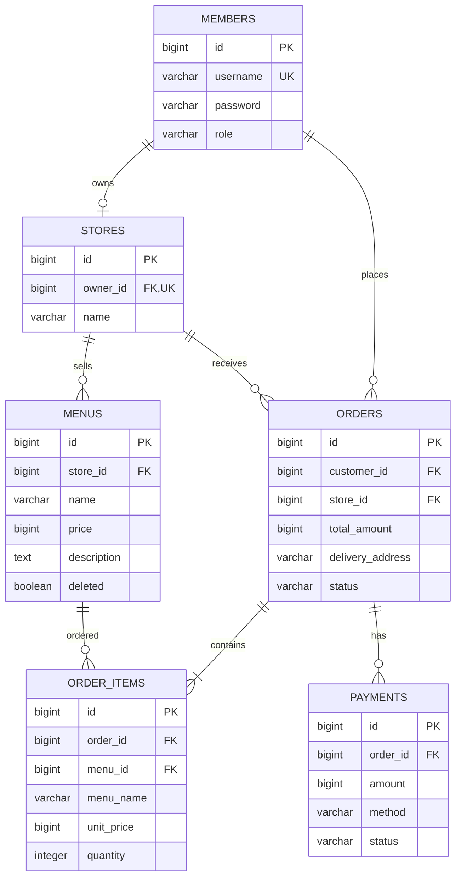
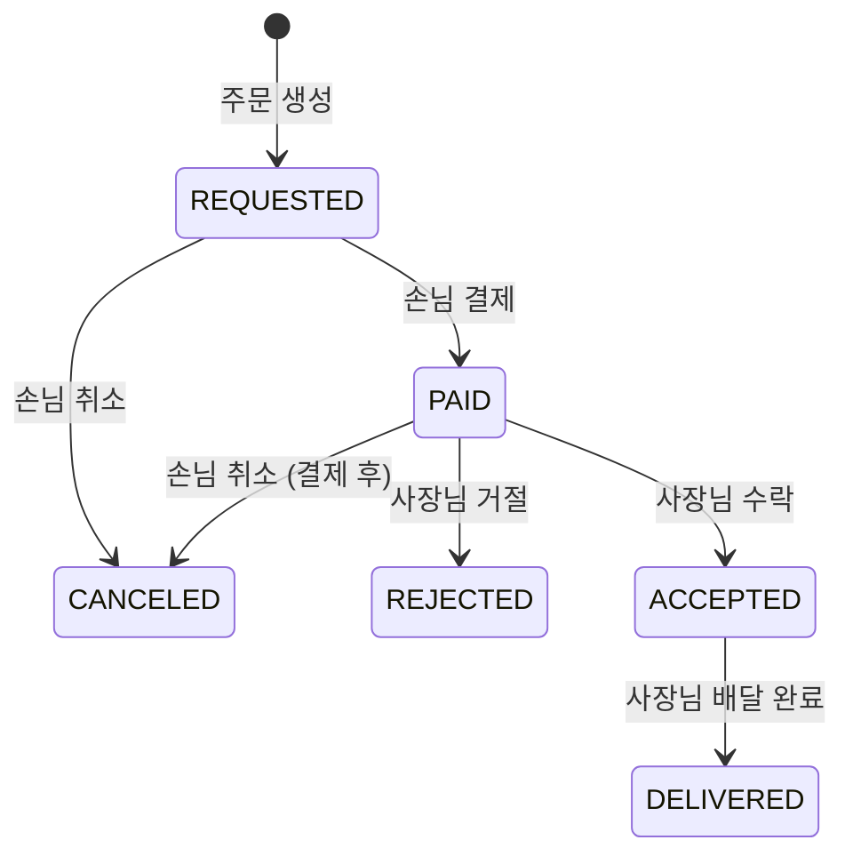

# 미니 배달 주문 서비스

사장님(OWNER)이 가게와 메뉴를 등록하면, 손님(CUSTOMER)이 메뉴를 조회해 주문하고 결제하는 백엔드 API입니다. 사장님은 결제된 주문을 수락하거나 거절하고, 수락한 주문을 배달 완료로 처리합니다. 화면은 없으며 Postman 같은 API 도구로 호출합니다.

- 사장님 한 명당 가게 한 곳을 운영합니다.
- 한 주문에 같은 가게의 메뉴 여러 개를 담을 수 있습니다.
- 실제 결제사(PG) 연동 없이 카드 결제 내역만 DB에 저장합니다.

테이블 명세, 요청·응답 필드, 기능별 상세 규칙은 [설계 문서](docs/delivery-design.md)에 정리했습니다.

## 1. 개발 환경과 기술 스택

| 구분 | 내용 |
| --- | --- |
| 언어 | Java 21 |
| 프레임워크 | Spring Boot 4.1.1 (Spring Web MVC, Spring Data JPA, Spring Security, Validation) |
| 인증 | JWT (JJWT 0.13.0, HS256), BCrypt 비밀번호 해시 |
| DB | PostgreSQL 18 (Docker Compose) |
| 빌드 | Gradle (Groovy DSL, Wrapper 포함) |
| 기타 | Lombok, JPA Auditing |

## 2. 주요 기능

### 기본 기능

| 기능 | 내용 |
| --- | --- |
| 회원가입·로그인 | 비밀번호를 BCrypt로 해시해 저장하고, 로그인하면 JWT 액세스 토큰 발급 |
| 인증·인가 | JWT 필터에서 토큰을 검증하고, 역할(SecurityConfig)과 데이터 소유권(Service)을 나눠 검사 |
| 메뉴 | 사장님의 메뉴 등록·수정·삭제(Soft Delete), 누구나 메뉴 조회 |
| 주문 | 손님의 주문 생성·취소, 역할별 주문 목록 |
| 주문 상태 변경 | 사장님의 수락(`ACCEPTED`)과 배달 완료(`DELIVERED`) |
| 결제 | 주문 총액으로 카드 결제 내역을 저장하고 주문을 `PAID`로 변경 |

### 도전 기능

| 기능 | 내용 |
| --- | --- |
| 가게(Store) 분리 | 가게 등록·조회 API 추가, 메뉴와 주문이 가게를 참조 |
| 한 주문에 여러 메뉴 담기 | 주문 상품(OrderItem)에 주문 당시 메뉴 이름·단가를 저장 |
| 주문 단건 조회 | 손님은 본인 주문, 사장님은 본인 가게 주문 조회 |
| 결제 기록 조회 | 손님이 본인 주문의 결제 기록 조회 |
| 메뉴 목록 페이징 | `page`·`size`로 페이징, 최신 등록순 정렬 |
| 5분 이내 취소 제한 | 주문 생성 후 5분이 지나면 취소 불가 |
| 결제 후 취소 | 결제된 주문도 5분 이내면 취소, 결제 기록은 `CANCELED` |
| 사장님의 주문 거절 | 결제된 주문을 거절하면 주문은 `REJECTED`, 결제 기록은 `CANCELED` |
| 에러 응답 통일 | 모든 오류를 `ProblemDetail`로 응답하고 401·403 구분 |
| 주문 목록 N+1 방지 | `@EntityGraph`로 주문 상품을 함께 조회 |

## 3. ERD



- 모든 테이블에 `created_at`, `updated_at`이 있으며 ERD에서는 생략했습니다.
- 연관관계는 모두 지연 로딩(`fetch = LAZY`)입니다. 가게 → 사장님은 `@OneToOne`, 나머지는 `@ManyToOne`입니다.
- 주문 → 주문 상품은 `@OneToMany(mappedBy = "order", cascade = PERSIST)`로, 주문을 저장할 때 주문 상품도 함께 저장합니다.

## 4. API 목록

- 기본 주소는 `http://localhost:8080`이고, 요청·응답은 JSON입니다.
- 인증이 필요한 API는 `Authorization: Bearer {accessToken}` 헤더로 호출합니다.

| # | 기능 | Method | URL | 권한 | 성공 |
| --- | --- | --- | --- | --- | --- |
| 1 | 회원가입 | POST | `/api/members` | 누구나 | 201 |
| 2 | 로그인 | POST | `/api/auth/login` | 누구나 | 200 |
| 3 | 메뉴 등록 | POST | `/api/menus` | OWNER | 201 |
| 4 | 메뉴 목록 | GET | `/api/menus` | 누구나 | 200 |
| 5 | 메뉴 단건 | GET | `/api/menus/{menuId}` | 누구나 | 200 |
| 6 | 메뉴 수정 | PUT | `/api/menus/{menuId}` | OWNER, 본인 가게 메뉴 | 200 |
| 7 | 메뉴 삭제 | DELETE | `/api/menus/{menuId}` | OWNER, 본인 가게 메뉴 | 204 |
| 8 | 주문 생성 | POST | `/api/orders` | CUSTOMER | 201 |
| 9 | 주문 목록 | GET | `/api/orders` | 로그인 회원 | 200 |
| 10 | 주문 취소 | PATCH | `/api/orders/{orderId}/cancel` | CUSTOMER, 본인 주문 | 200 |
| 11 | 주문 상태 변경 | PATCH | `/api/orders/{orderId}/status` | OWNER, 본인 가게 주문 | 200 |
| 12 | 결제 | POST | `/api/orders/{orderId}/payments` | CUSTOMER, 본인 주문 | 201 |
| 13 | 가게 등록 (도전) | POST | `/api/stores` | OWNER | 201 |
| 14 | 내 가게 조회 (도전) | GET | `/api/stores/mine` | OWNER | 200 |
| 15 | 주문 단건 조회 (도전) | GET | `/api/orders/{orderId}` | CUSTOMER는 본인 주문, OWNER는 본인 가게 주문 | 200 |
| 16 | 결제 기록 조회 (도전) | GET | `/api/orders/{orderId}/payments` | CUSTOMER, 본인 주문 | 200 |
| 17 | 주문 거절 (도전) | PATCH | `/api/orders/{orderId}/reject` | OWNER, 본인 가게 주문 | 200 |

주문 생성 요청 예시:

```json
{
  "items": [
    {"menuId": 1, "quantity": 2},
    {"menuId": 2, "quantity": 1}
  ],
  "deliveryAddress": "서울시 예시 주소 101호"
}
```

실패 응답은 모두 Spring의 `ProblemDetail` 형식(`application/problem+json`)입니다.

| 코드 | 상황 |
| --- | --- |
| 400 | 입력값 오류, 같은 메뉴 중복, 다른 가게 메뉴 혼합 |
| 401 | 로그인 실패, 토큰 누락·만료·위조 |
| 403 | 역할이 맞지 않음, 다른 사람의 메뉴·주문·결제 기록 접근 |
| 404 | 없는 대상, 삭제된 메뉴의 조회·수정·삭제·새 주문 |
| 409 | 아이디·가게 중복, 가게 없이 메뉴 등록, 허용되지 않는 상태 변경, 취소 시간 초과 |
| 500 | 예상하지 못한 서버 오류, 결제 기록 불일치 같은 데이터 오류 |

## 5. 주문 상태와 주요 처리 규칙



| 처리 | 허용 조건 |
| --- | --- |
| 결제 | 본인 주문이며 `REQUESTED` |
| 취소 | 본인 주문이며 `REQUESTED` 또는 `PAID`, 주문 생성 후 5분 이내 |
| 수락 | 본인 가게 주문이며 `PAID` |
| 배달 완료 | 본인 가게 주문이며 `ACCEPTED` |
| 거절 | 본인 가게 주문이며 `PAID` (5분 제한 없음) |

표에 없는 변경은 409로 거절하고, `DELIVERED`·`CANCELED`·`REJECTED` 주문은 다시 변경할 수 없습니다.

- **서버가 정하는 값:** 주문자·가게·단가·총액·결제 금액은 요청으로 받지 않고, 인증 정보와 DB 값으로 정합니다.
- **주문 생성:** 한 주문에는 같은 가게의 메뉴만 담을 수 있습니다. 없거나 삭제된 메뉴가 하나라도 있으면 404이며, 주문은 저장되지 않습니다.
- **주문 금액:** 총액은 상품별 `단가 × 수량`의 합입니다. 주문 당시의 메뉴 이름과 단가를 저장하므로, 나중에 메뉴가 바뀌거나 삭제되어도 기존 주문은 그대로입니다.
- **결제·취소·거절:** 주문 상태 변경과 결제 기록 변경을 하나의 트랜잭션으로 처리합니다. 결제 기록은 지우지 않고 상태만 `CANCELED`로 바꾸며, 실제 환불은 하지 않습니다.
- **5분 취소 제한:** 서버의 현재 시각과 주문 생성 시각을 비교하며, 정확히 5분인 시점까지 취소할 수 있습니다.
- **동시 요청:** 같은 주문에 대한 동시 요청을 막는 락은 적용하지 않았습니다.

## 6. 실행 방법

### 1) 환경 변수 설정

DB 비밀번호와 JWT 비밀키는 코드나 설정 파일에 넣지 않고 환경 변수로 받습니다.

| 이름 | 설명 |
| --- | --- |
| `DB_PASSWORD` | PostgreSQL `delivery` 계정의 비밀번호. Docker 컨테이너 생성과 애플리케이션 접속에 같은 값을 사용 |
| `JWT_SECRET` | Base64로 인코딩한 32바이트(256비트) 이상의 HS256 서명 키. 더 짧으면 애플리케이션이 시작되지 않음 |

`.env.example`을 복사해 `.env`를 만들고 값을 채웁니다. `.env`는 Git에 올라가지 않습니다.

```bash
cp .env.example .env
```

```dotenv
# 예시 값입니다. 실제 값으로 바꿔서 사용하세요.
DB_PASSWORD=change-me
JWT_SECRET=change-me-base64-encoded-32-bytes-or-more
```

`JWT_SECRET`은 `openssl rand -base64 32`로 만들 수 있습니다. 토큰 만료 시간은 `application.yaml`의 `jwt.expiration-ms`(기본 1시간)입니다.

### 2) DB 실행

`compose.yaml`이 `.env`의 `DB_PASSWORD`를 읽어 PostgreSQL 18 컨테이너(`delivery-postgres`)를 만듭니다. 접속 주소는 `jdbc:postgresql://localhost:5432/delivery`입니다.

```bash
docker compose up -d
```

### 3) 애플리케이션 실행

Spring Boot는 `.env` 파일을 자동으로 읽지 않으므로, 환경 변수를 설정한 뒤 실행합니다.

```bash
set -a && . ./.env && set +a && ./gradlew bootRun
```

IntelliJ에서는 Run/Debug Configurations → `DeliveryApplication` → Environment variables에 `DB_PASSWORD`와 `JWT_SECRET`을 입력합니다.

- 애플리케이션은 `http://localhost:8080`에서 실행됩니다.
- 테이블은 `ddl-auto: update` 설정으로 자동 생성됩니다(로컬 학습 환경용).

## 7. 프로젝트 구조

```
com.example.delivery
├── common     BaseEntity(생성·수정 시각), 예외와 공통 예외 처리
├── config     SecurityConfig, JpaAuditingConfig
├── security   JWT 발급·검증, 인증 필터, 401·403 응답 처리
├── member     회원가입
├── auth       로그인
├── store      가게
├── menu       메뉴
├── order      주문, 주문 상품
└── payment    결제
```

각 도메인은 `controller → service → repository` 순서로 호출하고, 요청·응답은 `dto` 패키지의 record로 주고받습니다.
