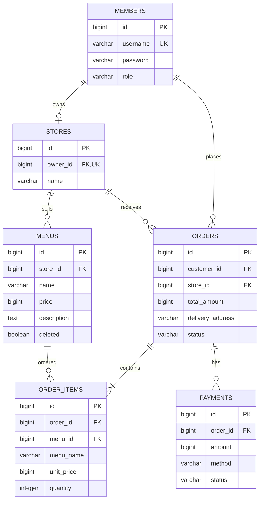
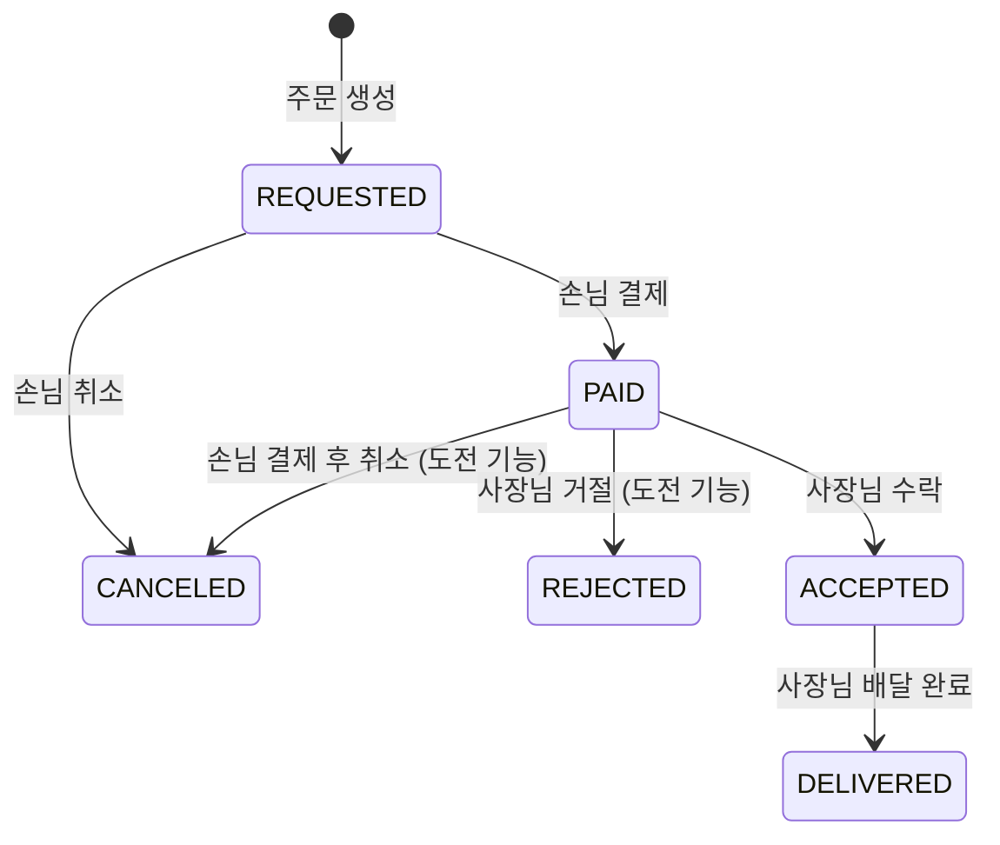

# 미니 배달 주문 서비스 설계 문서

- 작성일: 2026.10.06
- 최종 수정일: 2026.10.08
- 문서 기준: 기본 기능과 도전 기능을 반영한 최종 설계
- 프로젝트명: delivery
- 패키지명: com.example.delivery

## 1. 서비스 개요

사장님이 메뉴를 등록하면 손님이 메뉴를 조회하고 주문·결제할 수 있는 서비스이다. 사장님은 결제된 주문을 수락하고 배달 완료로 변경한다. 화면은 만들지 않고 Postman으로 백엔드 API를 확인한다.

| 항목 | 내용 |
| --- | --- |
| 가게 | Store 엔티티로 관리하며 사장님 한 명당 가게 한 곳 |
| 주문 | 한 주문에 같은 가게의 메뉴 여러 개와 각 수량을 저장 |
| 결제 | 실제 결제사 연동 없이 카드 결제 내역만 DB에 저장 |
| 배달 | 사장님이 배달 완료 처리 |
| 역할 | CUSTOMER, OWNER |

### 개발 환경

| 항목 | 선택 |
| --- | --- |
| Java | 21 |
| Spring Boot | 4.1.x 정식 버전 |
| 빌드 도구 | Gradle — Groovy |
| DB | PostgreSQL 18 |
| DB 실행 | Docker |
| 사용 기술 | Spring Web, Spring Data JPA, Spring Security, JWT, Validation, BCrypt |
| 확인 도구 | Postman |

### 사용자 역할

| 역할 | 가능한 기능 |
| --- | --- |
| CUSTOMER | 메뉴 조회, 주문 생성, 본인 주문 조회·취소·결제 |
| OWNER | 메뉴 조회, 본인 메뉴 등록·수정·삭제, 본인 가게에 들어온 주문 조회·상태 변경 |
| 비회원 | 회원가입, 로그인, 메뉴 목록·단건 조회 |

## 2. ERD



생성·수정 시각은 여섯 테이블 모두에 포함하며, ERD에서는 생략했다.

주문 상품(OrderItem)을 분리해 한 주문에 같은 가게의 메뉴 여러 개를 담는다. 가게(Store)를 별도 엔티티로 관리하며 메뉴와 주문은 가게를 참조한다.

| 관계 | JPA 매핑 |
| --- | --- |
| Store → Member(사장님) | @OneToOne(fetch = FetchType.LAZY), owner_id UNIQUE — 사장님 한 명당 가게 하나 (도전 기능) |
| Menu → Store | @ManyToOne(fetch = FetchType.LAZY) — 가게 하나에 메뉴 여러 개 (도전 기능) |
| Order → Member(손님) | @ManyToOne(fetch = FetchType.LAZY) |
| Order → Store | @ManyToOne(fetch = FetchType.LAZY) — 주문은 한 가게에만 한다 (도전 기능) |
| OrderItem → Order | @ManyToOne(fetch = FetchType.LAZY) — order_items.order_id를 가진 연관관계의 주인 (도전 기능) |
| Order → OrderItem | @OneToMany(mappedBy = "order", cascade = PERSIST) — 주인이 아닌 쪽, 주문 생성 시 상품도 함께 저장 (도전 기능) |
| OrderItem → Menu | @ManyToOne(fetch = FetchType.LAZY) (도전 기능) |
| Payment → Order | @ManyToOne(fetch = FetchType.LAZY) |

결제와 주문은 N:1 관계로 둔다. 따라서 payments.order_id 전체에 UNIQUE를 설정하지 않는다. 기본 기능에서는 이미 결제된 주문의 재결제를 거절한다.

## 3. 테이블 명세

기본키는 BIGINT 자동 증가로 정하고, JPA에서는 GenerationType.IDENTITY를 사용한다. 역할·상태·결제 수단은 @Enumerated(EnumType.STRING)으로 저장한다.

### 공통 컬럼

| 컬럼 | 타입 | 제약 | 설명 |
| --- | --- | --- | --- |
| id | BIGINT | PK, 자동 증가 | 식별자 |
| created_at | TIMESTAMP | NOT NULL | 생성 시각 |
| updated_at | TIMESTAMP | NOT NULL | 수정 시각 |

BaseEntity에 생성·수정 시각을 정의하고 여섯 Entity가 상속한다. @MappedSuperclass, @EntityListeners(AuditingEntityListener.class), @CreatedDate, @LastModifiedDate를 사용하고 설정 클래스에 @EnableJpaAuditing을 적용한다. Java 시각 타입은 LocalDateTime으로 사용한다.

### 회원 — members

| 컬럼 | 타입 | 제약 | 설명 |
| --- | --- | --- | --- |
| username | VARCHAR(20) | NOT NULL, UNIQUE | 로그인 아이디 |
| password | VARCHAR(255) | NOT NULL | BCrypt로 해시한 비밀번호 |
| role | VARCHAR(20) | NOT NULL | CUSTOMER / OWNER |

- 아이디는 4~20자, 비밀번호는 8자 이상이다.
- 비어 있거나 공백만 있는 값은 허용하지 않는다.
- 아이디 중복은 Service에서 확인하고 DB에도 UNIQUE 제약을 설정한다.
- 비밀번호는 응답에 포함하지 않는다.

### 가게 — stores (도전 기능)

| 컬럼 | 타입 | 제약 | 설명 |
| --- | --- | --- | --- |
| owner_id | BIGINT | NOT NULL, UNIQUE, FK → members.id | 사장님 |
| name | VARCHAR(100) | NOT NULL | 가게 이름 |

- 사장님 한 명당 가게 하나다. 중복 등록은 Service에서 확인하고(409) DB에도 UNIQUE 제약을 설정한다.
- 사장님은 요청 본문이 아닌 인증 정보에서 가져온다.
- 가게 수정·삭제·공개 목록, 한 사장님의 여러 가게 운영은 범위에 포함하지 않는다.

### 메뉴 — menus

| 컬럼 | 타입 | 제약 | 설명 |
| --- | --- | --- | --- |
| store_id | BIGINT | NOT NULL, FK → stores.id | 가게 |
| name | VARCHAR(100) | NOT NULL | 메뉴 이름 |
| price | BIGINT | NOT NULL | 가격, 원 단위 |
| description | TEXT | 선택 | 메뉴 설명 |
| deleted | BOOLEAN | NOT NULL | 삭제 여부, 처음에는 false |

- 메뉴 이름은 필수이고 가격은 1원 이상이다.
- 메뉴는 인증된 사장님의 가게에 등록한다. 요청 본문으로 사장님이나 가게를 받지 않는다. 가게가 없으면 409 "가게를 먼저 등록해야 합니다."이다.
- 삭제 시 행을 지우지 않고 deleted=true로 변경한다.
- 삭제된 메뉴는 메뉴 조회·수정·삭제·새 주문 생성에서 404로 처리한다.
- 기존 주문 기록은 유지한다.

### 주문 — orders

| 컬럼 | 타입 | 제약 | 설명 |
| --- | --- | --- | --- |
| customer_id | BIGINT | NOT NULL, FK → members.id | 주문한 손님 |
| store_id | BIGINT | NOT NULL, FK → stores.id | 주문한 가게 (도전 기능) |
| total_amount | BIGINT | NOT NULL | 주문 시 계산한 총액 = 주문 상품 금액의 합 |
| delivery_address | VARCHAR(500) | NOT NULL | 배송 주소 |
| status | VARCHAR(20) | NOT NULL | 주문 상태 |

- 배송 주소는 필수이다.
- 주문자는 인증 정보에서, 가게는 주문한 메뉴의 가게에서 정한다.
- 총액은 서버가 주문 상품 금액(주문 당시 단가 × 수량)을 더해 계산한다.
- 메뉴 가격이 바뀌어도 이미 저장한 주문 총액은 변경하지 않는다.
- 최초 상태는 REQUESTED이다.

### 주문 상품 — order_items (도전 기능)

| 컬럼 | 타입 | 제약 | 설명 |
| --- | --- | --- | --- |
| order_id | BIGINT | NOT NULL, FK → orders.id | 주문 |
| menu_id | BIGINT | NOT NULL, FK → menus.id | 주문한 메뉴 |
| menu_name | VARCHAR(100) | NOT NULL | 주문 당시 메뉴 이름 |
| unit_price | BIGINT | NOT NULL | 주문 당시 메뉴 가격 |
| quantity | INTEGER | NOT NULL | 수량, 1 이상 |

- 한 주문에는 같은 가게의 메뉴만 담는다. 같은 메뉴를 여러 항목으로 나눠 담을 수 없다.
- 메뉴 이름과 가격을 주문 당시 값으로 복사해 두므로(스냅샷), 메뉴가 수정·삭제되어도 주문 상품은 그대로 남는다.
- 상품 금액은 unit_price × quantity로 계산하며 따로 저장하지 않는다.
- 주문·결제 기록은 지우지 않으므로 주문 상품도 삭제하지 않는다(cascade REMOVE·orphanRemoval 없음).

### 결제 — payments

| 컬럼 | 타입 | 제약 | 설명 |
| --- | --- | --- | --- |
| order_id | BIGINT | NOT NULL, FK → orders.id | 결제한 주문 |
| amount | BIGINT | NOT NULL | 결제 금액 |
| method | VARCHAR(20) | NOT NULL | CARD |
| status | VARCHAR(20) | NOT NULL | COMPLETED / CANCELED (CANCELED는 도전 기능: 결제 후 취소) |

- 결제 수단은 CARD만 허용한다.
- 결제 금액은 주문에 저장된 total_amount를 사용한다.
- 성공하면 COMPLETED 결제 내역을 저장한다.
- 결제 후 취소는 도전 기능으로 추가했다(아래 "도전 기능 — 결제 후 취소"). 취소한 주문의 재결제는 범위에 포함하지 않는다.

메뉴 이름 100자·주소 500자는 컬럼 크기를 정하기 위한 선택이다. 요청 DTO에도 동일한 최대 길이를 적용한다.

## 4. 주문 상태

| 상태 | 의미 |
| --- | --- |
| REQUESTED | 주문요청 |
| PAID | 결제완료 |
| ACCEPTED | 주문수락 |
| DELIVERED | 배달완료 |
| CANCELED | 주문취소 |
| REJECTED | 주문거절 (도전 기능: 사장님의 주문 거절) |



| 처리 | 허용 조건 |
| --- | --- |
| 결제 | 본인 주문이며 REQUESTED 상태 |
| 취소 | 본인 주문이며 REQUESTED 또는 PAID 상태(PAID는 도전 기능), 주문 생성 후 5분 이내 (도전 기능) |
| 주문 수락 | 본인 가게에 들어온 주문이며 PAID 상태 |
| 배달 완료 | 본인 가게에 들어온 주문이며 ACCEPTED 상태 |
| 주문 거절 (도전 기능) | 본인 가게에 들어온 주문이며 PAID 상태 (5분 제한 없음) |

"본인 가게에 들어온 주문"은 `order.store.owner.id`가 인증 회원 id와 같은지로 판단한다(주문 목록·단건·수락·배달 완료·거절 공통). 메뉴 수정·삭제의 본인 확인은 `menu.store.owner.id` 기준이다.

표에 없는 변경은 409로 거절한다. 종료된 주문(DELIVERED, CANCELED, REJECTED)은 다시 변경할 수 없다.

## 5. API 명세

### 공통 규칙

- 기본 주소: http://localhost:8080
- 요청·응답: JSON
- 인증: Authorization: Bearer {토큰}
- 요청·응답은 DTO로 처리하고 Entity를 그대로 반환하지 않는다.
- 로그인 없이 가능한 기능: 회원가입, 로그인, 메뉴 조회
- 주문 목록은 CUSTOMER이면 본인 주문, OWNER이면 본인 가게에 들어온 주문만 반환한다.
- 주문 목록에는 페이징을 적용하지 않는다.
- 메뉴 목록은 도전 기능으로 페이징을 적용하고 최신 등록순으로 정렬한다. 아래 "도전 기능 — 메뉴 목록 페이징·최신 등록순 정렬"을 따른다.

### API 목록

| # | 기능 | Method | URL | 권한 | 성공 |
| --- | --- | --- | --- | --- | --- |
| 1 | 회원가입 | POST | /api/members | 누구나 | 201 |
| 2 | 로그인 | POST | /api/auth/login | 누구나 | 200 |
| 3 | 메뉴 등록 | POST | /api/menus | OWNER | 201 |
| 4 | 메뉴 목록 | GET | /api/menus | 누구나 | 200 |
| 5 | 메뉴 단건 | GET | /api/menus/{menuId} | 누구나 | 200 |
| 6 | 메뉴 수정 | PUT | /api/menus/{menuId} | 본인 가게 OWNER | 200 |
| 7 | 메뉴 삭제 | DELETE | /api/menus/{menuId} | 본인 가게 OWNER | 204 |
| 8 | 주문 생성 | POST | /api/orders | CUSTOMER | 201 |
| 9 | 주문 목록 | GET | /api/orders | 로그인 회원 | 200 |
| 10 | 주문 취소 | PATCH | /api/orders/{orderId}/cancel | 본인 주문 CUSTOMER | 200 |
| 11 | 주문 상태 변경 | PATCH | /api/orders/{orderId}/status | 본인 가게 OWNER | 200 |
| 12 | 결제 | POST | /api/orders/{orderId}/payments | 본인 주문 CUSTOMER | 201 |
| 13 | 가게 등록 | POST | /api/stores | OWNER | 201 |
| 14 | 내 가게 조회 | GET | /api/stores/mine | OWNER | 200 |
| 15 | 주문 단건 조회 | GET | /api/orders/{orderId} | 본인 주문 CUSTOMER / 본인 가게 OWNER | 200 |
| 16 | 결제 기록 조회 | GET | /api/orders/{orderId}/payments | 본인 주문 CUSTOMER | 200 |
| 17 | 주문 거절 | PATCH | /api/orders/{orderId}/reject | 본인 가게 OWNER | 200 |

취소와 사장님의 상태 변경은 각각 API를 둔다. 취소 API는 요청 본문 없이 호출하면 CANCELED로 변경한다. 상태 변경 API는 ACCEPTED 또는 DELIVERED를 받는다.

### 도전 기능 — 주문 단건 조회

- `GET /api/orders/{orderId}`로 주문 한 건을 조회한다. 요청 본문은 없다.
- CUSTOMER는 본인 주문만, OWNER는 본인 가게에 들어온 주문만 조회할 수 있다.
- 주문이 없으면 404, 주문은 있지만 소유권이 없으면 403이다. 토큰이 없거나 유효하지 않으면 401이다.
- 성공 시 200과 주문 응답을 반환한다. 삭제된 메뉴가 포함된 기존 주문도 조회할 수 있다.

### 도전 기능 — 가게(Store) 분리

| 기능 | Method | URL | 권한 | 성공 |
| --- | --- | --- | --- | --- |
| 가게 등록 | POST | /api/stores | OWNER | 201 |
| 내 가게 조회 | GET | /api/stores/mine | OWNER | 200 |

- 가게 등록 요청은 `name`(필수, 100자 이하)이고, 응답은 `id`, `name`, `createdAt`, `updatedAt`이다.
- 이미 가게가 있으면 409 "이미 가게를 등록했습니다.", 내 가게가 없으면 404 "등록된 가게가 없습니다."이다.
- 토큰이 없으면 401, CUSTOMER가 요청하면 403이다.
- 메뉴 응답에 `storeId`를 추가했다. 기존 `ownerId`는 `menu.store.owner.id` 값으로 그대로 제공한다.
- 메뉴 등록은 가게가 있어야 하며, 가게가 없으면 409이다. 메뉴 목록·단건은 기존처럼 비회원도 조회할 수 있다.

### 도전 기능 — 결제 기록 조회

| 기능 | Method | URL | 권한 | 성공 |
| --- | --- | --- | --- | --- |
| 결제 기록 조회 | GET | /api/orders/{orderId}/payments | 본인 주문 CUSTOMER | 200 |

- 요청 본문은 없고 주문 ID는 경로 변수로 받는다.
- 응답은 결제 응답(id, orderId, amount, method, status, createdAt, updatedAt)의 배열이며, 결제하지 않은 주문이면 빈 배열 []을 반환한다.
- 처리 순서는 주문 조회(404) → 본인 주문 확인(403) → 결제 기록 조회이다.
- OWNER는 역할 검사에서 403으로 거절한다. 사장님의 결제 기록 조회 권한은 요구사항에 없으므로 두지 않는다.
- 메뉴가 삭제되어도 기존 주문의 결제 기록은 조회할 수 있다.

### 도전 기능 — 메뉴 목록 페이징·최신 등록순 정렬

기존 메뉴 목록 API(`GET /api/menus`)를 확장한다. 비회원도 조회할 수 있고, 삭제되지 않은 전체 메뉴가 대상이다.

| 쿼리 파라미터 | 기본값 | 범위 | 오류 |
| --- | --- | --- | --- |
| page | 0 | 0 이상, 0부터 시작 | 범위 밖 또는 숫자가 아니면 400 |
| size | 10 | 1~100 | 범위 밖 또는 숫자가 아니면 400 |

- 정렬은 등록 시각(createdAt) 내림차순이고, 등록 시각이 같으면 id 내림차순이다. 클라이언트가 정렬 기준을 바꿀 수는 없다.
- 페이징과 정렬은 DB 쿼리에서 처리한다(Spring Data JPA `Pageable`).
- 응답은 배열이 아니라 페이징 객체로 바뀐다: `content`(메뉴 응답 배열), `page`, `size`, `totalElements`, `totalPages`.
- 메뉴가 없거나 마지막 페이지를 넘는 page를 요청하면 `content`는 빈 배열 []이다.

### 도전 기능 — 주문 생성 후 5분 이내 취소 제한

기존 주문 취소 API(`PATCH /api/orders/{orderId}/cancel`)에 시간 조건을 추가한다.

- 처리 순서는 주문 조회(404) → 본인 주문 확인(403) → 상태 확인(REQUESTED 또는 PAID가 아니면 409) → 시간 확인이다.
- 기준 시각은 서버의 현재 시각이며, 요청 한 번에 한 번 구해 비교한다. 클라이언트가 보낸 시각이나 응답에 표시된 초 단위 문자열로 판단하지 않는다.
- 비교 대상은 DB와 Entity에 저장된 주문 생성 시각(createdAt, 마이크로초 정밀도)이다.
- 경계: `현재 시각 ≤ createdAt + 5분`이면 취소를 허용한다. 정확히 5분인 시점은 허용하고, 그보다 조금이라도 늦으면 거절한다.
- 시간이 지나 거절되면 409와 "주문 생성 후 5분이 지나 취소할 수 없습니다."를 반환하며, 주문 상태와 수정 시각은 바뀌지 않는다.
- 상태 규칙과 시간 규칙은 모두 주문 Entity의 `cancel(LocalDateTime now)`에서 검사한다.
- 5분 조건은 REQUESTED 주문과 PAID 주문(결제 후 취소) 모두에 적용한다.

### 도전 기능 — 결제 후 취소

기존 주문 취소 API(`PATCH /api/orders/{orderId}/cancel`)가 PAID 주문도 취소할 수 있도록 확장한다.

- 취소 가능한 상태는 REQUESTED와 PAID이다. ACCEPTED, DELIVERED, CANCELED, REJECTED는 409로 거절한다.
- 처리 순서는 주문 조회(404) → 본인 주문 확인(403) → 상태 확인(409) → 5분 확인(409) → (PAID 주문만) 완료된 결제 기록 1건 확인(500) → 주문·결제 상태 변경이다. 검사를 모두 통과한 뒤에만 주문과 결제 객체의 상태를 바꾸므로, 결제 기록 확인에서 실패하면 두 객체 모두 기존 상태로 남는다. 검사 메서드(`Order.validateCancelable`)는 상태를 바꾸지 않고, 실제 변경 메서드(`Order.cancel`)도 같은 검사를 거친다.
- PAID 주문을 취소하면 그 주문의 COMPLETED 결제 기록을 CANCELED로 바꾸고, 주문도 CANCELED로 바꾼다. 두 변경은 하나의 트랜잭션에서 처리한다.
- 결제 기록은 지우지 않는다. 금액·수단·생성 시각은 그대로 두고 상태만 바꾸며, 결제 기록 조회 API에 CANCELED로 남는다.
- REQUESTED 주문을 취소할 때는 결제 기록을 만들지 않는다.
- 실제 결제사 연동이나 환불은 하지 않는다. DB의 결제 상태만 바꾼다.
- PAID 주문의 COMPLETED 결제 기록은 정확히 1건이어야 한다. 0건이나 여러 건이면 임의로 고르지 않고 서버 데이터 오류(500)로 처리해 전체를 롤백한다. 응답에는 내부 상세를 담지 않는다.
- 취소한 주문의 재결제는 기존처럼 409로 거절한다.
- 상태 확인만으로 같은 주문에 대한 동시 결제·취소 요청까지 막을 수는 없다. 동시성 제어는 범위에 포함하지 않는다.

### 도전 기능 — 사장님의 주문 거절

| 기능 | Method | URL | 권한 | 성공 |
| --- | --- | --- | --- | --- |
| 주문 거절 | PATCH | /api/orders/{orderId}/reject | 본인 가게 OWNER | 200 |

과제에 세부 규칙이 없어 다음 기준으로 정했다.

- 요청 본문은 없고, 응답은 주문 응답(id, storeId, items, totalAmount, deliveryAddress, status, createdAt, updatedAt)이다.
- PAID → REJECTED만 허용한다. REQUESTED, ACCEPTED, DELIVERED, CANCELED, REJECTED 주문은 409 "결제 완료 상태의 주문만 거절할 수 있습니다."로 거절한다.
- 손님 취소의 5분 제한은 적용하지 않는다.
- 처리 순서는 주문 조회(404) → 본인 가게 확인(403) → 상태 확인(409) → 완료된 결제 기록 1건 확인(500) → 주문·결제 상태 변경이다. 검사 메서드(`Order.validateRejectable`)는 상태를 바꾸지 않고, 실제 변경 메서드(`Order.reject`)도 같은 검사를 거친다. 이 순서는 실패 시 객체 상태를 보존하기 위한 것이며 동시 요청 문제를 해결하지는 않는다.
- 주문은 REJECTED, 그 주문의 COMPLETED 결제 기록은 CANCELED로 바꾸며, 두 변경은 하나의 트랜잭션에서 처리한다. 결제 기록은 지우지 않고 금액·수단·생성 시각을 유지하며, 결제 기록 조회에 CANCELED로 남는다.
- 완료된 결제 기록이 0건이나 여러 건이면 결제 후 취소와 같이 서버 데이터 오류(500)로 처리하고 전체를 롤백한다.
- 실제 결제사 연동·환불, 거절 사유, 알림은 범위에 포함하지 않는다.
- 메뉴가 삭제되어도 기존 주문은 거절할 수 있다.
- REJECTED 주문은 결제, 수락, 배달 완료, 손님 취소, 재거절이 모두 409이다.
- 상태 확인만으로 같은 주문에 대한 동시 요청까지 막을 수는 없다.

### 요청 명세

| 기능 | 요청 필드 | 검증 |
| --- | --- | --- |
| 회원가입 | username, password, role | 아이디 4~20자, 비밀번호 8자 이상·UTF-8 기준 72바이트 이하, 역할 필수 |
| 가게 등록 | name | 필수·100자 이하 |
| 내 가게 조회 | 본문 없음 | 인증된 사장님의 가게 조회 |
| 주문 단건 조회 | 본문 없음 | 주문 ID는 경로 변수 |
| 결제 기록 조회 | 본문 없음 | 주문 ID는 경로 변수 |
| 주문 거절 | 본문 없음 | 주문 ID는 경로 변수 |
| 로그인 | username, password | 두 값 필수 |
| 메뉴 등록·수정 | name, price, description | 이름 필수·100자 이하, 가격 1 이상, 설명 선택 |
| 메뉴 목록 | 본문 없음 | 쿼리 파라미터 page(0 이상, 기본 0), size(1~100, 기본 10) |
| 메뉴 단건 | 본문 없음 | 단건 ID는 경로 변수 |
| 메뉴 삭제 | 본문 없음 | 메뉴 ID는 경로 변수 |
| 주문 생성 | items[{menuId, quantity}], deliveryAddress | items 필수·1개 이상·null 항목 불가, 각 메뉴 ID·수량 필수·1 이상, 같은 메뉴 ID 중복 불가(400), 주소 필수·500자 이하 (도전 기능: 여러 메뉴 담기) |
| 주문 목록 | 본문 없음 | 인증된 회원의 역할로 조회 범위 결정 |
| 주문 취소 | 본문 없음 | 주문 ID는 경로 변수 |
| 주문 상태 변경 | status | ACCEPTED / DELIVERED |
| 결제 | method | CARD |

PUT 메뉴 수정은 이름·가격·설명 전체를 교체한다. 이름·가격이 없으면 400, 설명이 없으면 null로 저장한다. 숫자 필드는 Long·Integer로 받아 @NotNull과 @Positive를 함께 사용한다. 문자열 필수값은 @NotBlank, 길이는 @Size, Controller에는 @Valid를 적용한다.

주문 생성 요청 (여러 메뉴 담기):
```json
{
  "items": [
    {"menuId": 1, "quantity": 2},
    {"menuId": 2, "quantity": 1}
  ],
  "deliveryAddress": "서울시 테스트 주소 101호"
}
```

- 모든 메뉴가 같은 가게여야 한다. 다른 가게의 메뉴가 섞이면 400 "한 주문에는 같은 가게의 메뉴만 담을 수 있습니다."이다.
- 없는 메뉴나 삭제된 메뉴가 하나라도 있으면 404이며, 이때 주문과 주문 상품은 하나도 저장하지 않는다.
- 주문자·가게·가격·총액·상태는 요청으로 받지 않는다.

주문 상태 변경 요청:
```json
{"status": "ACCEPTED"}
```

결제 요청:
```json
{"method": "CARD"}
```

### 응답 명세

| 기능 | 응답 필드 |
| --- | --- |
| 회원가입 | id, username, role |
| 로그인 | accessToken |
| 메뉴 등록·단건·수정 | id, ownerId, storeId(도전 기능: 가게 분리), name, price, description, createdAt, updatedAt |
| 가게 등록·내 가게 조회 (도전 기능) | id, name, createdAt, updatedAt |
| 메뉴 목록 | content(위 메뉴 응답의 배열), page, size, totalElements, totalPages |
| 메뉴 삭제 | 본문 없음 |
| 주문 생성·단건·취소·상태 변경·거절 | id, storeId, items, totalAmount, deliveryAddress, status, createdAt, updatedAt |
| 주문 상품 (items의 각 항목) | id, menuId, menuName, unitPrice, quantity, subtotal(= unitPrice × quantity). 주문 상품 id 오름차순 |
| 주문 목록 | 위 주문 응답의 배열 |
| 결제 | id, orderId, amount, method, status, createdAt, updatedAt |

목록이 없으면 빈 배열 []을 반환한다. 메뉴 목록은 페이징 객체의 content가 빈 배열 []이다.

주문 생성 응답 예시 — 3,500원 메뉴 2개 + 2,000원 메뉴 1개:
```json
{
  "id": 1,
  "storeId": 1,
  "items": [
    {"id": 1, "menuId": 1, "menuName": "김밥", "unitPrice": 3500, "quantity": 2, "subtotal": 7000},
    {"id": 2, "menuId": 2, "menuName": "라면", "unitPrice": 2000, "quantity": 1, "subtotal": 2000}
  ],
  "totalAmount": 9000,
  "deliveryAddress": "서울시 테스트 주소 101호",
  "status": "REQUESTED",
  "createdAt": "2026-10-06T12:00:00",
  "updatedAt": "2026-10-06T12:00:00"
}
```

### 실패 상태 코드

| 코드 | 상황 |
| --- | --- |
| 400 | 필수값 누락, 길이·수량·가격 오류, 잘못된 JSON·enum, 카드 외 결제 수단, 숫자가 아닌 경로 변수·쿼리 파라미터, 방화벽이 거절한 비정상 경로(`//`, `;` 등) |
| 401 | 로그인 실패, 보호 API의 토큰 누락·만료·위조·형식 오류·필수 claim 누락 |
| 403 | 역할이 맞지 않음, 다른 사람의 메뉴·주문·결제 기록 처리 |
| 404 | 없는 대상, 메뉴 API 또는 새 주문에서 삭제 메뉴 접근 |
| 409 | 아이디 중복, 가게 중복 등록, 가게 없이 메뉴 등록, 이미 결제된 주문, 허용되지 않는 상태 변경, 주문 취소 시간 초과 |
| 500 | 예상하지 못한 서버 오류, 결제 기록 불일치 같은 데이터 오류 (내부 상세는 응답에 담지 않음) |

인증 실패는 401, 역할이나 데이터 소유권 불일치는 403으로 구분하며, 오류 응답은 아래 ProblemDetail 형식으로 통일한다.

### 도전 기능 — 에러 응답 형식 통일 + 401·403 구분 

모든 오류 응답은 Spring의 ProblemDetail 형식(`Content-Type: application/problem+json`)이며 `type`, `title`, `status`, `detail`, `instance`를 담는다. 입력 검증 오류는 `errors`에 필드별 메시지를 추가한다.

| 오류가 생기는 곳 | 처리하는 곳 | 응답 |
| --- | --- | --- |
| Controller·Service (검증, 404, 소유권 403, 409, 500) | `@RestControllerAdvice` (`ResponseEntityExceptionHandler` 상속) | ProblemDetail |
| JWT 필터·인가 단계의 인증 실패 | `AuthenticationEntryPoint` | 401 ProblemDetail |
| 인가 단계의 역할 불일치 | `AccessDeniedHandler` | 403 ProblemDetail |
| Security 방화벽이 거절한 요청 | `RequestRejectedHandler` Bean | 400 ProblemDetail |

- Security 필터 단계의 오류는 DispatcherServlet에 도달하지 않으므로 `@RestControllerAdvice`가 처리할 수 없다. 그래서 필터 단계 처리기 세 곳에서 같은 형식으로 응답을 직접 작성한다.
- 서명이 올바른 토큰이라도 필수 claim(sub, username, role)이 없으면 401로 처리해, 필터의 예외가 서버 오류로 넘어가지 않게 한다.
- 오류 처리를 위한 `/error` 재전달(ERROR dispatch)은 인가 검사를 통과시켜, 원래 상태 코드가 401로 바뀌지 않게 한다. 클라이언트가 `/error`를 직접 호출하면 기존처럼 인증이 필요하다.
- 공개 API(회원가입, 로그인, 메뉴 목록·단건)는 토큰이 없거나 잘못되어도 기존처럼 호출할 수 있다.

## 6. 인증과 주요 처리

### 회원·인증

1. 가입 시 아이디 중복과 입력값을 확인한다.
2. 비밀번호를 BCrypt로 해시해 저장한다.
3. 로그인 시 아이디·비밀번호를 검증한다.
4. JWT에 아이디·역할·만료 시간을 담아 발급한다.
5. 보호된 API는 필터에서 토큰을 검증한다.
6. Service는 인증된 회원 정보를 사용해 소유권을 확인한다.

JWT 만료 시간은 설정값으로 관리한다. 비밀번호는 JWT나 응답에 담지 않는다. 실제 DB 비밀번호·JWT 비밀키는 Git에 올리지 않는다.

### 주문·결제

1. 주문 생성 시 활성 메뉴를 모두 조회해 검증(없거나 삭제 404, 가게 혼합 400)한 뒤 금액을 계산한다. 주문과 주문 상품은 하나의 트랜잭션에서 함께 저장한다.
2. 주문자는 인증 정보로 지정하고 REQUESTED로 저장한다.
3. 결제 시 본인 주문인지, REQUESTED 상태인지 확인한다.
4. 주문 총액으로 결제 내역을 저장하고 주문을 PAID로 변경한다.
5. 결제 저장과 주문 변경은 하나의 @Transactional 안에서 처리한다.

이미 PAID인 주문은 다시 결제할 수 없다. 동시 요청 처리용 락·추가 인덱스는 이번 설계 범위에서 제외하며, 상태 확인만으로 동시 결제까지 보장하는 것은 아니다.

### 목록 조회

Spring Data JPA Query Methods를 사용한다.

| 목적 | 메서드 예시 |
| --- | --- |
| 아이디 중복 확인 | existsByUsername(String username) |
| 로그인 회원 조회 | findByUsername(String username) |
| 활성 메뉴 목록 (도전 기능: 페이징·정렬) | findAllByDeletedFalse(Pageable pageable) |
| 활성 메뉴 단건 | findByIdAndDeletedFalse(Long id) |
| CUSTOMER 주문 목록 (상품 함께 조회) | findAllByCustomer_Id(Long customerId) + @EntityGraph("items") |
| OWNER 주문 목록 (상품 함께 조회) | findAllByStore_Owner_Id(Long ownerId) + @EntityGraph("items") |
| 주문할 활성 메뉴 여러 개 (도전 기능) | findAllByIdInAndDeletedFalse(Collection<Long> ids) |
| 사장님의 가게 조회 | findByOwner_Id(Long ownerId), existsByOwner_Id(Long ownerId) |
| 주문의 결제 기록 | findAllByOrder_Id(Long orderId) |

주문 목록 응답에 필요한 상품을 함께 조회하도록 `@EntityGraph(attributePaths = "items")`를 적용해, 주문별 상품 조회로 발생하는 N+1 문제를 방지한다.

기존 주문 조회에는 메뉴의 deleted=false 조건을 넣지 않는다.

## 7. 로컬 인프라와 프로젝트 구조

Spring Boot는 개발 PC의 8080 포트에서 실행하고, PostgreSQL은 Docker의 5432 포트로 연결한다.

| 구성 | 역할 |
| --- | --- |
| Postman | 요청 전송 및 응답 확인 |
| Security 필터 | JWT 검증·역할 확인 |
| Controller | 요청 DTO 검증·응답 |
| Service | 소유권·상태·금액 계산·트랜잭션 |
| Repository | JPA를 통한 DB 조회·저장 |
| PostgreSQL | 회원·가게·메뉴·주문·주문 상품·결제 데이터 저장 |

DB 연결 주소는 jdbc:postgresql://localhost:5432/delivery로 사용한다. DB 계정·비밀번호·DB 이름은 Docker 생성 시 설정한 값과 일치해야 한다. 설정 파일은 application.yaml을 사용한다.

| 패키지 | 주요 구성 |
| --- | --- |
| common | BaseEntity |
| config | SecurityConfig, JpaAuditingConfig |
| security | JWT 발급·검증 관련 클래스 |
| member | 회원 Controller, Service, Repository, Entity, DTO |
| auth | 로그인 Controller, Service, DTO |
| store | 가게 Controller, Service, Repository, Entity, DTO (도전 기능) |
| menu | 메뉴 Controller, Service, Repository, Entity, DTO |
| order | 주문 Controller, Service, Repository, Entity, DTO |
| payment | 결제 Controller, Service, Repository, Entity, DTO |

각 도메인 안에서 controller, service, repository, entity, dto로 구분한다. Controller는 Service를 호출하고, Service가 Repository를 호출한다.
